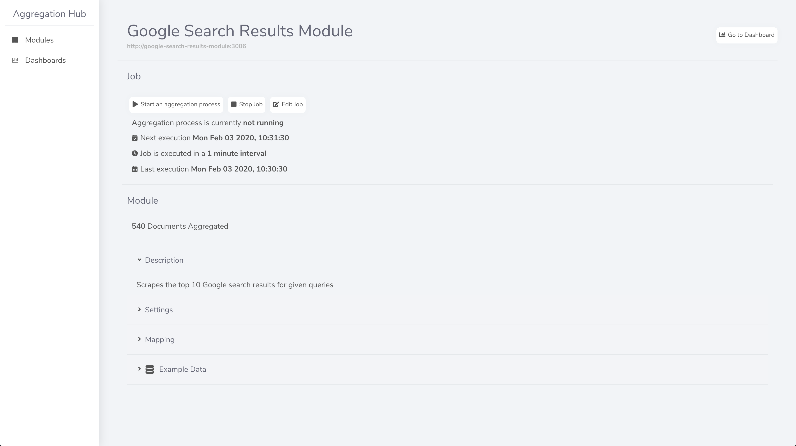
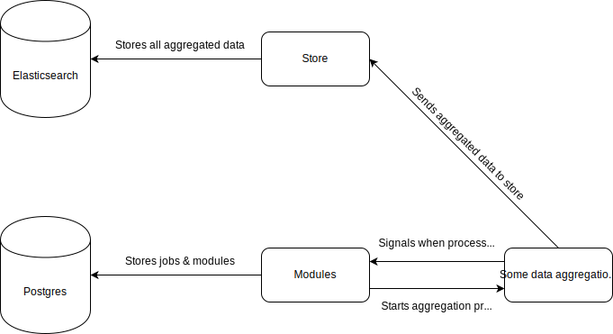

# Aggregation Hub

A platform to aggregate data from all kinds of different sources.

## How does Aggregation Hub work?

Aggregation Hub works with modules. A module is a standalone application/server that extracts data from a data source (e.g. CSV files, web sites, APIs, databases, etc.). The extracted data is then stored in a database (currently Elasticsearch) for easy access and visualizations (currently possible with Kibana).

This module system makes it possible to create a new module with any programming language that is capable of creating a HTTP API. It also allows the user to add modules that are not hosted by himself.

You can define jobs for each module. You can set an interval for the data aggregation and start or stop the job execution.

The user can also set settings for a module, e.g. the Google Search Results Module has a setting for the search queries for which the module should aggregate data.

### Modules

You can create your own modules. Look at the examples in the `modules` folder to get started. Basically you need to have two mandatory API endpoints:

`POST /start => starts the aggregation process`

`GET /config => to expose the module config`

#### Module Config

Every module needs to have a `config.json` file.

Example:

    {
        routes: {
            [route: string]: {
                description: string;
                method: "GET" | "POST" | "PUT" | "DELETE";
                query: {
                    [queryParam: string]: {
                        type:
                        | "string[]"
                        | "number[]"
                        | "boolean"
                        | "string"
                        | "number"
                        | "boolean[]";
                        description: string;
                        required: boolean;
                    };
                };
                body: {
                    [bodyParam: string]: {
                        type:
                        | "string[]"
                        | "number[]"
                        | "boolean"
                        | "string"
                        | "number"
                        | "boolean[]";
                        description: string;
                        required: boolean;
                    };
                };
                configurable: boolean; => True, if this route has settings that can be changed by the user
            };
        };
        description: string;
        author: string;
    };

## Usage

Prerequisites:

You need to set the environment variables in multiple locations. Example files are included where it is necessary to set those variables.
You also need Docker Compose on your machine.

To start the development environment you need to run `sh start_services.sh`.

If you just would like to quickly see the Aggregation Hub in action you can run `sh quick_start.sh`.

The UI is available at `http://localhost:3001`. To add the sample module you will have to use the address `http://google-search-results-module:3006`.

On the overview page of your newly added module you will have to create a job and also define the search queries in the settings.

## Future Plans

- Add authentication
- Create shareable data streams
  - User can select data sources and make this data accessible via a public or secured API endpoint
- Create more modules
- Create dashboard to replace Kibana
- Create a "store" for data aggregation modules

## Used Technologies

Node.js, TypeScript, Postgres, React + Next.js, Elasticsearch, Kibana

## Disclaimer

Aggregation Hub is in semi active development and is not ready for usage yet.
